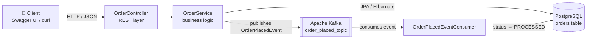

# 🛒 Retail Order System


**Retail Order System** is an event-driven REST API for managing retail orders, built with **Spring Boot 3.1**, **PostgreSQL**, and **Apache Kafka**. Every order lifecycle action is exposed through a clean REST interface, persisted to PostgreSQL, and announced to downstream services as an `OrderPlacedEvent` on a Kafka topic — a production-shaped microservices pattern, small enough to understand in one sitting.

The whole system is verified end-to-end by **Testcontainers-based integration tests**: real PostgreSQL and real Kafka brokers are started as throwaway Docker containers, so every test run exercises actual persistence and actual event flow — not mocks.

---

## 🏗️ Architecture



### Components

| Component | Layer | Responsibility |
|---|---|---|
| `OrderController` | REST | CRUD endpoints under `/orders`, documented via OpenAPI 3 |
| `OrderService` | Service | Persists orders and publishes `OrderPlacedEvent` to Kafka on creation |
| `OrderRepository` | Persistence | Spring Data JPA repository over the `orders` table |
| `Order` | Domain | JPA entity — `id`, `status`, `description` |
| `OrderPlacedEvent` | Messaging | Immutable Java `record`, serialized to JSON on the wire |
| `KafkaConfig` | Messaging | Producer/consumer factories with JSON (de)serializers |
| `OrderPlacedEventConsumer` | Messaging | `@KafkaListener` that processes events and marks orders `PROCESSED` |
| `DockerImageConstants` | Testing | Single source of truth for the Postgres/Kafka images used in tests |

### Order flow, end to end

1. `POST /orders` → the order is persisted to PostgreSQL.
2. The same request path publishes an `OrderPlacedEvent` (JSON) to the `order_placed_topic`.
3. The consumer group picks the event up, loads the order, sets its status to `PROCESSED`, and saves it.
4. `GET /orders/{id}` now reflects the processed state — persistence and messaging verified together.

### Why event-driven?

Once "order placed" is a message instead of a method call, new capabilities (inventory reservation, email notifications, analytics, fraud checks) become *new subscribers* — zero changes to the API contract. This project implements the exact shape of that integration: one producer, one topic, one consumer, JSON payloads, schema-safe `record` types.

---

## ✨ Features

- Full CRUD REST API for orders (`POST`, `GET`, `PUT`, `DELETE`)
- PostgreSQL persistence via Spring Data JPA with schema auto-provisioning (`schema.sql` / `data.sql`)
- Asynchronous `OrderPlacedEvent` publishing to Kafka on every order creation
- Kafka consumer that processes events and advances order status
- OpenAPI 3 / Swagger UI for interactive API exploration
- Health and info endpoints via Spring Boot Actuator
- Dockerized infrastructure: PostgreSQL, Kafka, Zookeeper, and Kafka UI with one command
- Testcontainers integration tests covering the complete HTTP → database → Kafka → consumer flow
- GitHub Actions CI running the integration suites on every push and pull request

---

## 🧰 Tech Stack

| Technology | Purpose |
|---|---|
| Java 17 | Language runtime |
| Spring Boot 3.1 | Application framework (Web, Data JPA, Kafka, Actuator) |
| PostgreSQL 16 | Relational persistence |
| Apache Kafka (Confluent 7.9) | Event streaming backbone |
| Testcontainers 1.19 | Real-infrastructure integration testing |
| JUnit 5 + Awaitility | Test framework and async assertions |
| Springdoc OpenAPI 2 | Interactive API documentation |
| Docker + Docker Compose | Local infrastructure and application image |
| GitHub Actions | Continuous integration |

---

## 📂 Project Structure

```text
Retail-Order-System/
├── .github/workflows/ci.yml      # GitHub Actions CI (build + integration tests)
├── docker-compose.yml            # PostgreSQL + Kafka + Zookeeper + Kafka UI
├── Dockerfile                    # Runtime image for the API
├── pom.xml                       # Maven build (Spring Boot 3.1, Testcontainers BOM)
└── src/
    ├── main/
    │   ├── java/com/retailordersystem/
    │   │   ├── RetailOrderSystemApplication.java
    │   │   ├── config/           # KafkaConfig, OpenApiConfig
    │   │   ├── constants/        # Docker image constants (shared with tests)
    │   │   ├── controller/       # OrderController (REST)
    │   │   ├── event/            # OrderPlacedEvent (record)
    │   │   ├── model/            # Order (JPA entity)
    │   │   ├── repository/       # OrderRepository (Spring Data JPA)
    │   │   └── service/          # OrderService, OrderPlacedEventConsumer
    │   └── resources/
    │       ├── application.properties
    │       ├── schema.sql        # DDL auto-provisioned at startup
    │       └── data.sql          # Seed data
    └── test/java/com/retailordersystem/controller/   # 3 integration suites
```

---

## 🚀 Getting Started

### Prerequisites

| Tool | Version |
|---|---|
| JDK | 17+ |
| Maven | 3.6+ |
| Docker | Latest (for infrastructure and tests) |

### 1. Build

```bash
git clone https://github.com/hulamanisrinish-cpu/Retail-Order-System.git
cd Retail-Order-System
mvn clean install
```

### 2. Start the infrastructure

```bash
docker-compose up -d
```

| Service | Endpoint |
|---|---|
| PostgreSQL 16 | `localhost:5432` (`retaildb` / `postgres` / `postgres`) |
| Kafka (Confluent 7.9) | `localhost:9092` |
| Kafka UI | http://localhost:8081 |

### 3. Run the application

```bash
mvn spring-boot:run
```

- **API base URL:** http://localhost:8080
- **Swagger UI:** http://localhost:8080/swagger-ui/index.html
- **Health check:** http://localhost:8080/actuator/health

> ℹ️ The database schema is created and seeded automatically at startup from `schema.sql` and `data.sql` — no manual migration step.

### 4. Build the application image (optional)

```bash
mvn clean package
docker build -t retail-order-system .
docker run -p 8080:8080 --network host retail-order-system
```

---

## 📡 API Reference

| Method | Endpoint | Description | Success |
|---|---|---|---|
| `POST` | `/orders` | Create an order (also emits `OrderPlacedEvent`) | `201 Created` |
| `GET` | `/orders/{id}` | Fetch a single order | `200 OK` |
| `GET` | `/orders` | List all orders | `200 OK` |
| `PUT` | `/orders/{id}` | Update an order's status | `200 OK` |
| `DELETE` | `/orders/{id}` | Delete an order | `204 No Content` |

### Try it

```bash
# Create an order — this also publishes an OrderPlacedEvent to Kafka
curl -X POST http://localhost:8080/orders \
  -H "Content-Type: application/json" \
  -d '{"status": "NEW", "description": "Gaming laptop"}'

# List all orders
curl http://localhost:8080/orders

# Fetch one order
curl http://localhost:8080/orders/1

# Update status
curl -X PUT http://localhost:8080/orders/1 \
  -H "Content-Type: application/json" \
  -d '{"status": "SHIPPED", "description": "Gaming laptop"}'

# Delete
curl -X DELETE http://localhost:8080/orders/1
```

Watch the event flow live in **Kafka UI** (http://localhost:8081): the `order_placed_topic` receives a JSON event for every created order, and the consumer flips the order status to `PROCESSED`.

---

## 🧪 Testing

The test strategy is deliberately integration-first: instead of mocking persistence and messaging, the suites spin up **real PostgreSQL and Kafka containers** and exercise the complete order flow.

| Suite | Strategy | Infrastructure |
|---|---|---|
| `OrderControllerIntegrationTestWithServiceConnection` | Spring Boot 3.1 `@ServiceConnection` auto-wiring | Testcontainers (self-started) |
| `OrderControllerIntegrationTestWithTestcontainers` | Explicit container wiring via `@DynamicPropertySource` | Testcontainers (self-started) |
| `OrderControllerIntegrationTest` | Full-stack test against the local environment | Requires `docker-compose up -d` first |

**Every suite asserts the full end-to-end flow:**

1. `POST /orders` returns `201 Created`
2. The order row is persisted in PostgreSQL
3. An `OrderPlacedEvent` with the correct order id lands on `order_placed_topic` (verified with a real Kafka consumer + [Awaitility](https://github.com/awaitility/awaitility))
4. The consumer processes the event and marks the order `PROCESSED`

### Run the tests

```bash
# Self-contained Testcontainers suites — only Docker required
mvn test -Dtest='OrderControllerIntegrationTestWith*'

# Full suite, including the local-environment suite
docker-compose up -d
mvn test
```

Continuous integration runs the two Testcontainers suites on every push and pull request — see the CI badge at the top of this file. Test reports are uploaded as workflow artifacts.

---

## 🔄 CI/CD

The [CI workflow](.github/workflows/ci.yml) runs on GitHub Actions:

- ✅ Sets up JDK 17 (Temurin) with Maven dependency caching
- ✅ Runs `mvn -B verify` — the full build **plus the Testcontainers integration suites** (Docker is preinstalled on GitHub runners)
- ✅ Uploads Surefire test reports as artifacts on every run
- ✅ Triggers on every push to `main` and on all pull requests

---

## 🗺️ Roadmap

- [ ] JWT authentication with role-based access on the API
- [ ] Richer order lifecycle events (`PAID`, `SHIPPED`, `DELIVERED`)
- [ ] Transactional outbox pattern for guaranteed event delivery
- [ ] Observability: Micrometer metrics + Grafana dashboards
- [ ] Kubernetes manifests / Helm chart
- [ ] Testcontainers Cloud matrix for parallel CI runs

---

## 🤝 Contributing

Contributions are welcome! Please read [CONTRIBUTING.md](CONTRIBUTING.md) for setup, test, and pull-request guidelines.

---

## 📄 License

Released under the [MIT License](LICENSE) — © 2026 Srinish Hulamani.

---

## 👤 Author

**Srinish Hulamani** — electronics & communication engineering student building secure, intelligent systems at the intersection of cybersecurity, AI, and scalable infrastructure.

- 🔗 GitHub: [@hulamanisrinish-cpu](https://github.com/hulamanisrinish-cpu)
- 💼 LinkedIn: [cipherbysrinish](https://www.linkedin.com/in/cipherbysrinish)
