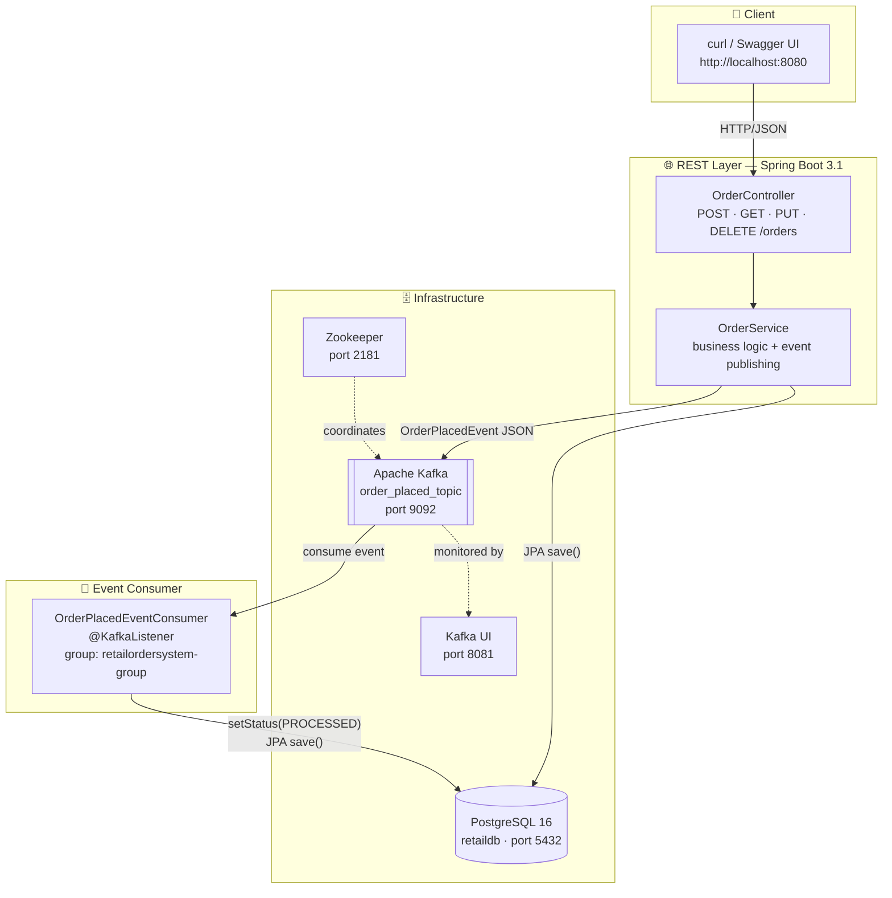

<div align="center">


# 🛒 Retail Order System

### *Event-Driven Microservices Architecture · Spring Boot 3.1 · PostgreSQL · Apache Kafka*

<br/>

[](https://github.com/hulamanisrinish-cpu/Retail-Order-System/actions/workflows/ci.yml)
[](https://adoptium.net/)
[](https://spring.io/projects/spring-boot)
[](https://www.postgresql.org/)
[](https://kafka.apache.org/)
[](https://testcontainers.com/)
[](LICENSE)
[](https://maven.apache.org/)
[](https://docs.docker.com/compose/)
[](http://localhost:8080/swagger-ui/index.html)

<br/>

> **A production-shaped event-driven REST API** demonstrating how `POST /orders` triggers real Kafka events,  
> persists to PostgreSQL, and gets consumed — all verified by Testcontainers integration tests with zero mocks.

<br/>

[🚀 Quick Start](#-getting-started) · [📐 Architecture](#-architecture) · [📡 API Reference](#-api-reference) · [🧪 Testing](#-testing) · [🔄 CI/CD](#-cicd)

---

</div>

## 📌 What Is This?

**Retail Order System** is a fully working, end-to-end event-driven microservices project built with:

- **Spring Boot 3.1** — clean REST layer with full CRUD
- **PostgreSQL 16** — relational persistence via Spring Data JPA
- **Apache Kafka (Confluent 7.9)** — asynchronous event streaming
- **Testcontainers 1.19** — real infrastructure in integration tests, not mocks

Every time an order is created via the REST API, the system:
1. Persists it to **PostgreSQL**
2. Publishes an `OrderPlacedEvent` to a **Kafka topic**
3. A consumer picks it up and marks the order **`PROCESSED`** — end-to-end, verified

This is the exact pattern used in production microservice architectures: decoupled services communicating through events, observable in real time via Kafka UI.

---

## 🏗️ Architecture

### System Overview

```
┌─────────────────────────────────────────────────────────────────────────┐
│                        RETAIL ORDER SYSTEM                              │
│                                                                         │
│   ┌──────────────┐    HTTP/JSON    ┌─────────────────────────────────┐  │
│   │   Client      │ ─────────────► │         REST Layer              │  │
│   │  (curl /      │                │  OrderController  /orders       │  │
│   │  Swagger UI)  │ ◄───────────── │  POST · GET · PUT · DELETE      │  │
│   └──────────────┘    JSON resp    └───────────────┬─────────────────┘  │
│                                                    │                    │
│                                                    ▼                    │
│                                   ┌─────────────────────────────────┐  │
│                                   │       Business Logic            │  │
│                                   │         OrderService            │  │
│                                   │   save() + kafkaTemplate.send() │  │
│                                   └────────────┬───────┬────────────┘  │
│                                                │       │               │
│                              JPA/Hibernate     │       │  publish      │
│                                                ▼       ▼               │
│                        ┌──────────────┐    ┌───────────────────────┐   │
│                        │  PostgreSQL  │    │     Apache Kafka       │   │
│                        │  port 5432   │    │   order_placed_topic   │   │
│                        │  (retaildb)  │    │   Confluent 7.9        │   │
│                        └──────┬───────┘    └──────────┬────────────┘   │
│                               │                       │                │
│                               │ findById()            │ @KafkaListener │
│                               │ + save(PROCESSED)     │ consume event  │
│                               │       ┌───────────────┘                │
│                               │       ▼                                │
│                               │  ┌────────────────────────────────┐   │
│                               └◄─│   OrderPlacedEventConsumer      │   │
│                                  │   group: retailordersystem-group│   │
│                                  │   status → PROCESSED            │   │
│                                  └────────────────────────────────┘   │
└─────────────────────────────────────────────────────────────────────────┘
```

### Data & Event Flow

```
POST /orders  ──►  [OrderController]
                         │
                         ▼
                   [OrderService]
                    ├──► orderRepository.save(order)          → PostgreSQL
                    └──► kafkaTemplate.send(                  → Kafka
                              "order_placed_topic",
                              OrderPlacedEvent{
                                orderId,
                                orderStatus: "PROCESSED",
                                description
                              }
                         )
                              │
                              ▼ (async, same JVM)
                   [OrderPlacedEventConsumer]
                    ├──► orderRepository.findById(orderId)    ← PostgreSQL
                    ├──► order.setStatus("PROCESSED")
                    └──► orderRepository.save(order)          → PostgreSQL

GET /orders/{id}  ──►  returns order with status=PROCESSED ✓
```

### Mermaid Flow Diagram



### Component Breakdown

| Component | Package | Role |
|---|---|---|
| `RetailOrderSystemApplication` | `com.retailordersystem` | Spring Boot entry point |
| `OrderController` | `controller` | REST endpoints — maps HTTP verbs to service calls |
| `OrderService` | `service` | Core logic: persists order, publishes `OrderPlacedEvent` to Kafka |
| `OrderPlacedEventConsumer` | `service` | `@KafkaListener` — consumes events, updates order to `PROCESSED` |
| `Order` | `model` | JPA entity: `id` (auto), `status` (String), `description` (String) |
| `OrderPlacedEvent` | `event` | Immutable Java `record` — `orderId`, `orderStatus`, `description` |
| `OrderRepository` | `repository` | Spring Data JPA interface over the `orders` table |
| `KafkaConfig` | `config` | `ProducerFactory` + `ConsumerFactory` with `JsonSerializer`/`JsonDeserializer` |
| `OpenApiConfig` | `config` | Springdoc OpenAPI 3 / Swagger UI configuration |
| `DockerImageConstants` | `constants` | Single source of truth for Docker image names used in tests |

---

## ✨ Features

<table>
<tr>
<td width="50%">

**🌐 REST API**
- Full CRUD: `POST`, `GET`, `PUT`, `DELETE` on `/orders`
- `201 Created` with persisted entity on POST
- `204 No Content` on DELETE
- OpenAPI 3 / Swagger UI at `/swagger-ui/index.html`
- Spring Boot Actuator at `/actuator/health`

</td>
<td width="50%">

**📨 Event-Driven Messaging**
- `OrderPlacedEvent` published to `order_placed_topic` on every order creation
- JSON serialization on the wire (type-safe Java `record`)
- Consumer group `retailordersystem-group`
- Asynchronous — API returns immediately, consumer runs in background

</td>
</tr>
<tr>
<td width="50%">

**🗄️ Data Layer**
- Spring Data JPA with PostgreSQL dialect
- Auto-provisioned schema via `schema.sql` at startup
- Seed data via `data.sql` (2 PENDING orders pre-loaded)
- No manual migration step needed

</td>
<td width="50%">

**🧪 Testing**
- 3 integration test suites — **zero mocks**
- Real PostgreSQL + Real Kafka via Testcontainers
- `@ServiceConnection` auto-wiring (Spring Boot 3.1+)
- `Awaitility` for async event assertions
- GitHub Actions CI on every push

</td>
</tr>
</table>

---

## 🧰 Tech Stack

| Technology | Version | Purpose |
|---|---|---|
| **Java** | 17 (Temurin) | Language & runtime |
| **Spring Boot** | 3.1.0 | Framework — Web, Data JPA, Kafka, Actuator |
| **PostgreSQL** | 16 (Alpine) | Relational persistence |
| **Apache Kafka** | Confluent 7.9.0 | Event streaming |
| **Apache Zookeeper** | Confluent 7.9.0 | Kafka coordination |
| **Kafka UI** | provectuslabs/latest | Real-time topic monitoring |
| **Spring Data JPA** | (via Boot) | ORM / repository layer |
| **Spring Kafka** | (via Boot) | Producer & consumer factories |
| **Springdoc OpenAPI** | 2.1.0 | Swagger UI / API docs |
| **Testcontainers** | 1.19.0 | Real-infra integration testing |
| **JUnit 5** | (via Boot) | Test framework |
| **Awaitility** | (via Boot) | Async assertion polling |
| **Docker + Compose** | Latest | Local infrastructure stack |
| **GitHub Actions** | — | Continuous integration |
| **Maven** | 3.6+ | Build tool |

---

## 📂 Project Structure

```
Retail-Order-System/
│
├── 📄 README.md                          ← you are here
├── 📄 LICENSE                            ← MIT · Srinish Hulamani
├── 📄 CONTRIBUTING.md                    ← contribution guidelines
├── 📄 Dockerfile                         ← eclipse-temurin:17-jre-alpine
├── 📄 docker-compose.yml                 ← full local stack (postgres + kafka + ui)
├── 📄 pom.xml                            ← Maven build (Spring Boot 3.1, TC BOM)
│
├── 📁 .github/
│   └── 📁 workflows/
│       └── 📄 ci.yml                     ← GitHub Actions CI pipeline
│
└── 📁 src/
    ├── 📁 main/
    │   ├── 📁 java/com/retailordersystem/
    │   │   ├── 📄 RetailOrderSystemApplication.java    ← @SpringBootApplication
    │   │   ├── 📁 config/
    │   │   │   ├── 📄 KafkaConfig.java                 ← producer/consumer beans
    │   │   │   └── 📄 OpenApiConfig.java               ← Swagger configuration
    │   │   ├── 📁 constants/
    │   │   │   └── 📄 DockerImageConstants.java         ← shared image names
    │   │   ├── 📁 controller/
    │   │   │   └── 📄 OrderController.java             ← REST endpoints
    │   │   ├── 📁 event/
    │   │   │   └── 📄 OrderPlacedEvent.java            ← Java record (immutable)
    │   │   ├── 📁 model/
    │   │   │   └── 📄 Order.java                       ← @Entity (id, status, desc)
    │   │   ├── 📁 repository/
    │   │   │   └── 📄 OrderRepository.java             ← Spring Data JPA
    │   │   └── 📁 service/
    │   │       ├── 📄 OrderService.java                ← save + publish event
    │   │       └── 📄 OrderPlacedEventConsumer.java    ← @KafkaListener
    │   └── 📁 resources/
    │       ├── 📄 application.properties               ← datasource + kafka config
    │       ├── 📄 schema.sql                           ← DDL (auto-run at startup)
    │       ├── 📄 data.sql                             ← seed data (2 PENDING orders)
    │       └── 📄 logback.xml                         ← logging config
    │
    └── 📁 test/
        └── 📁 java/com/retailordersystem/controller/
            ├── 📄 OrderControllerIntegrationTestWithServiceConnection.java  ← @ServiceConnection
            ├── 📄 OrderControllerIntegrationTestWithTestcontainers.java     ← @DynamicPropertySource
            └── 📄 OrderControllerIntegrationTest.java                       ← local docker-compose
```

---

## 🚀 Getting Started

### Prerequisites

| Tool | Version | Install |
|---|---|---|
| JDK | 17+ | [Adoptium Temurin](https://adoptium.net/) |
| Maven | 3.6+ | [maven.apache.org](https://maven.apache.org/download.cgi) |
| Docker Desktop | Latest | [docker.com](https://www.docker.com/products/docker-desktop/) |
| Git | Any | [git-scm.com](https://git-scm.com/) |

---

### Step 1 — Clone the Repository

```bash
git clone https://github.com/hulamanisrinish-cpu/Retail-Order-System.git
cd Retail-Order-System
```

---

### Step 2 — Start the Infrastructure

Spin up PostgreSQL, Kafka, Zookeeper and Kafka UI with a single command:

```bash
docker-compose up -d
```

Verify all containers are healthy:

```bash
docker-compose ps
```

| Container | Image | Port | Purpose |
|---|---|---|---|
| `retail-postgres` | `postgres:16-alpine` | `5432` | Database (`retaildb`) |
| `retail-zookeeper` | `confluentinc/cp-zookeeper:7.9.0` | `2181` | Kafka coordination |
| `retail-kafka` | `confluentinc/cp-kafka:7.9.0` | `9092` | Message broker |
| `retail-kafka-ui` | `provectuslabs/kafka-ui:latest` | `8081` | Topic monitoring UI |

---

### Step 3 — Build the Application

```bash
mvn clean install -DskipTests
```

---

### Step 4 — Run the Application

```bash
mvn spring-boot:run
```

The app starts on **http://localhost:8080**

| Endpoint | URL |
|---|---|
| 🌐 API Base | http://localhost:8080/orders |
| 📖 Swagger UI | http://localhost:8080/swagger-ui/index.html |
| 💚 Health Check | http://localhost:8080/actuator/health |
| 📊 Kafka UI | http://localhost:8081 |

> **ℹ️ Database auto-provisioned** — `schema.sql` creates the `orders` table and `data.sql` seeds 2 `PENDING` orders on every startup. No manual migration needed.

---

### Step 5 — Build & Run with Docker (Optional)

```bash
# 1. Package the jar
mvn clean package -DskipTests

# 2. Build the image
docker build -t retail-order-system:1.0.0 .

# 3. Run (connect to the docker-compose network)
docker run -p 8080:8080 \
  --network retail-order-system_default \
  -e SPRING_DATASOURCE_URL=jdbc:postgresql://retail-postgres:5432/retaildb \
  -e SPRING_KAFKA_BOOTSTRAP_SERVERS=retail-kafka:29092 \
  retail-order-system:1.0.0
```

---

## 📡 API Reference

Base URL: `http://localhost:8080`  
Interactive docs: [`/swagger-ui/index.html`](http://localhost:8080/swagger-ui/index.html)

---

### Create an Order

```http
POST /orders
Content-Type: application/json
```

**Request body:**
```json
{
  "status": "NEW",
  "description": "Gaming laptop — 16GB RAM"
}
```

**Response `201 Created`:**
```json
{
  "id": 3,
  "status": "NEW",
  "description": "Gaming laptop — 16GB RAM"
}
```

> ⚡ This call also publishes an `OrderPlacedEvent` to `order_placed_topic`. Watch Kafka UI at http://localhost:8081 to see it arrive in real time.

```bash
curl -X POST http://localhost:8080/orders \
  -H "Content-Type: application/json" \
  -d '{"status": "NEW", "description": "Gaming laptop"}'
```

---

### Get All Orders

```http
GET /orders
```

**Response `200 OK`:**
```json
[
  { "id": 1, "status": "PROCESSED", "description": "DUMMY ORDER" },
  { "id": 2, "status": "PROCESSED", "description": "DUMMY ORDER" },
  { "id": 3, "status": "NEW",       "description": "Gaming laptop" }
]
```

```bash
curl http://localhost:8080/orders
```

---

### Get Order by ID

```http
GET /orders/{id}
```

```bash
curl http://localhost:8080/orders/3
```

**Response `200 OK`:**
```json
{
  "id": 3,
  "status": "PROCESSED",
  "description": "Gaming laptop"
}
```

> Notice `status` flipped to `PROCESSED` — the Kafka consumer picked up the event and updated the DB asynchronously.

---

### Update an Order

```http
PUT /orders/{id}
Content-Type: application/json
```

```bash
curl -X PUT http://localhost:8080/orders/3 \
  -H "Content-Type: application/json" \
  -d '{"status": "SHIPPED", "description": "Gaming laptop"}'
```

**Response `200 OK`:**
```json
{
  "id": 3,
  "status": "SHIPPED",
  "description": "Gaming laptop"
}
```

---

### Delete an Order

```http
DELETE /orders/{id}
```

```bash
curl -X DELETE http://localhost:8080/orders/3
```

**Response `204 No Content`**

---

### Complete API Summary

| Method | Endpoint | Description | Status |
|---|---|---|---|
| `POST` | `/orders` | Create order + publish `OrderPlacedEvent` to Kafka | `201 Created` |
| `GET` | `/orders` | List all orders | `200 OK` |
| `GET` | `/orders/{id}` | Get single order by ID | `200 OK` |
| `PUT` | `/orders/{id}` | Update order status/description | `200 OK` |
| `DELETE` | `/orders/{id}` | Delete an order | `204 No Content` |
| `GET` | `/actuator/health` | Application health (Spring Actuator) | `200 OK` |
| `GET` | `/swagger-ui/index.html` | Interactive API documentation | `200 OK` |

---

## 📨 Event Model

### `OrderPlacedEvent` (Java Record)

```java
public record OrderPlacedEvent(
    Long   orderId,       // ID of the persisted order
    String orderStatus,   // Always "PROCESSED" when published by OrderService
    String description    // Free-text description from the order
) {}
```

**Kafka wire format (JSON):**
```json
{
  "orderId": 3,
  "orderStatus": "PROCESSED",
  "description": "Gaming laptop"
}
```

**Topic:** `order_placed_topic`  
**Consumer group:** `retailordersystem-group`  
**Serializer:** `JsonSerializer` (Spring Kafka)  
**Deserializer:** `JsonDeserializer<OrderPlacedEvent>`

---

## 🧪 Testing

The test strategy is **integration-first** — no Mockito, no embedded brokers, no fake databases. Every suite exercises the complete production flow through real infrastructure.

### Test Suites

#### 1. `OrderControllerIntegrationTestWithServiceConnection`
```
Strategy  : Spring Boot 3.1 @ServiceConnection auto-wiring
Infra     : Testcontainers (self-starting containers)
Postgres  : PostgreSQLContainer with @ServiceConnection (auto URL/creds injection)
Kafka     : KafkaContainer with @DynamicPropertySource for bootstrap-servers
Run in CI : ✅ Yes
```
Uses the new Spring Boot 3.1 `@ServiceConnection` annotation — zero manual property wiring for PostgreSQL. A `DynamicPropertySource` handles Kafka bootstrap servers. Fresh consumer group UUID per test run prevents offset collisions.

#### 2. `OrderControllerIntegrationTestWithTestcontainers`
```
Strategy  : Explicit @DynamicPropertySource wiring
Infra     : Testcontainers (self-starting containers)
Postgres  : PostgreSQLContainer → datasource.url/username/password injected manually
Kafka     : KafkaContainer → spring.kafka.bootstrap-servers injected
Run in CI : ✅ Yes
```
Classic Testcontainers approach — full control over every property. Good reference for pre-3.1 Spring Boot projects.

#### 3. `OrderControllerIntegrationTest`
```
Strategy  : Full-stack against a running docker-compose environment
Infra     : Requires docker-compose up -d on localhost
Run in CI : ❌ Excluded (expects localhost services)
```
Tests the complete deployed stack — application + docker-compose — exactly as it runs in production.

---

### What Every Test Asserts

```
1. POST /orders
   └── HTTP 201 Created ✓
   └── Response body contains status="NEW" ✓

2. PostgreSQL
   └── orderRepository.findAll() has exactly 1 order ✓
   └── order.getStatus() == "NEW" ✓

3. Kafka (via Awaitility, 5s timeout, 500ms poll)
   └── OrderPlacedEvent lands on order_placed_topic ✓
   └── event.orderId() matches saved order ID ✓
   └── event.orderStatus() == "PROCESSED" ✓
```

---

### Running the Tests

```bash
# Self-contained Testcontainers suites (only Docker required — no docker-compose up needed)
mvn test -Dtest="OrderControllerIntegrationTestWithServiceConnection,OrderControllerIntegrationTestWithTestcontainers"

# Wildcard shorthand (same two suites)
mvn test -Dtest="OrderControllerIntegrationTestWith*"

# All three suites including the local-stack test (docker-compose must be running)
docker-compose up -d
mvn test

# Full build + tests (what CI runs)
mvn -B verify -Dtest="!OrderControllerIntegrationTest"
```

---

### Test Results

```
[INFO] Tests run: 1, Failures: 0, Errors: 0, Skipped: 0 — OrderControllerIntegrationTestWithServiceConnection
[INFO] Tests run: 1, Failures: 0, Errors: 0, Skipped: 0 — OrderControllerIntegrationTestWithTestcontainers
[INFO] BUILD SUCCESS
```

> Test reports (Surefire XML) are uploaded as artifacts on every GitHub Actions run.

---

## 🔄 CI/CD

### GitHub Actions Pipeline

```yaml
Trigger : push to main · pull_request to main
Runner  : ubuntu-latest (Docker preinstalled)
JDK     : 17 Temurin (cached Maven dependencies)
Command : mvn -B verify -Dtest='!OrderControllerIntegrationTest'
Artifact: target/surefire-reports (uploaded on every run)
```

**Pipeline steps:**

```
┌─────────────────────────────────────────────────┐
│             GitHub Actions CI                   │
│                                                 │
│  1. actions/checkout@v4                         │
│  2. actions/setup-java@v4                       │
│     └── JDK 17 Temurin + Maven cache            │
│  3. mvn -B verify                               │
│     ├── compile                                 │
│     ├── run Testcontainers integration tests    │
│     │   ├── OrderControllerIntegrationTest      │
│     │   │   WithServiceConnection      ✅       │
│     │   └── OrderControllerIntegrationTest      │
│     │       WithTestcontainers         ✅       │
│     └── package (jar)                           │
│  4. actions/upload-artifact@v4                  │
│     └── surefire-reports (always)               │
└─────────────────────────────────────────────────┘
```

View live runs: [Actions tab](https://github.com/hulamanisrinish-cpu/Retail-Order-System/actions)

---

## ⚙️ Configuration Reference

### `application.properties`

```properties
# Server
server.port=8080

# PostgreSQL (override with docker-compose or env vars)
spring.datasource.url=jdbc:postgresql://localhost:5432/retaildb
spring.datasource.username=postgres
spring.datasource.password=postgres
spring.datasource.driver-class-name=org.postgresql.Driver
spring.jpa.properties.hibernate.dialect=org.hibernate.dialect.PostgreSQLDialect
spring.jpa.hibernate.ddl-auto=none
spring.jpa.show-sql=true
spring.sql.init.mode=always

# Kafka
spring.kafka.bootstrap-servers=localhost:9092

# Actuator
management.endpoints.web.exposure.include=health,info
management.endpoint.health.show-details=always
```

### Environment Variable Overrides (Docker / K8s)

| Property | Env Variable | Default |
|---|---|---|
| Datasource URL | `SPRING_DATASOURCE_URL` | `jdbc:postgresql://localhost:5432/retaildb` |
| DB Username | `SPRING_DATASOURCE_USERNAME` | `postgres` |
| DB Password | `SPRING_DATASOURCE_PASSWORD` | `postgres` |
| Kafka Brokers | `SPRING_KAFKA_BOOTSTRAP_SERVERS` | `localhost:9092` |
| Server Port | `SERVER_PORT` | `8080` |

---

## 🗺️ Roadmap

- [ ] JWT authentication with Spring Security & role-based access control
- [ ] Richer order lifecycle: `NEW` → `PAID` → `SHIPPED` → `DELIVERED` → `CANCELLED`
- [ ] Dead-letter topic (DLT) for failed event processing
- [ ] Transactional outbox pattern for guaranteed exactly-once delivery
- [ ] Micrometer metrics + Prometheus + Grafana dashboards
- [ ] Kubernetes manifests + Helm chart
- [ ] Testcontainers Cloud for parallel matrix CI runs
- [ ] gRPC endpoint alongside REST
- [ ] Order search & filtering via Spring Data JPA Specifications

---

## 🤝 Contributing

Contributions are welcome and appreciated! Please read [CONTRIBUTING.md](CONTRIBUTING.md) for:

- Development environment setup
- Coding standards and conventions
- How to write tests (Testcontainers-first)
- Pull request workflow and review process

**Quick contribution flow:**

```bash
# 1. Fork and clone
git clone https://github.com/<your-username>/Retail-Order-System.git

# 2. Create a feature branch
git checkout -b feature/your-feature-name

# 3. Make changes and run tests
mvn test -Dtest="OrderControllerIntegrationTestWith*"

# 4. Commit and push
git commit -m "feat: your feature description"
git push origin feature/your-feature-name

# 5. Open a pull request on GitHub
```

---

## 📄 License

Released under the **[MIT License](LICENSE)** — © 2026 **Srinish Hulamani**

You are free to use, copy, modify, merge, publish, distribute, sublicense, and sell copies of this software.

---

## 👤 Author

<div align="center">

### Srinish Hulamani

*Electronics & Communication Engineering student building secure, intelligent systems  
at the intersection of cybersecurity, AI, and scalable distributed infrastructure.*

[](https://github.com/hulamanisrinish-cpu)
[](https://www.linkedin.com/in/cipherbysrinish)

</div>

---

<div align="center">

**If this project helped you understand event-driven architecture with Spring Boot,  
give it a ⭐ — it helps others find it too.**

*Built with ☕ Java, 🐘 PostgreSQL, 🗃️ Kafka, and 🐳 Docker*

</div>
